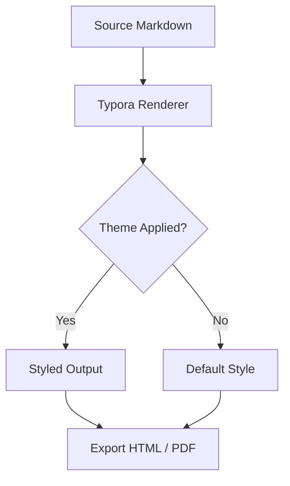
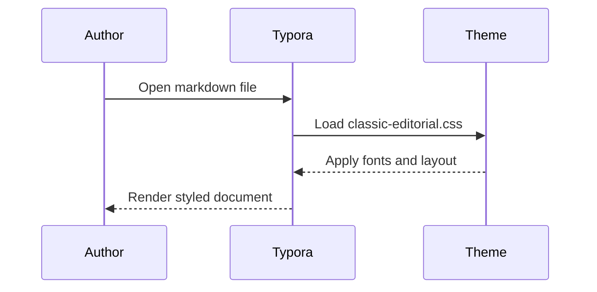
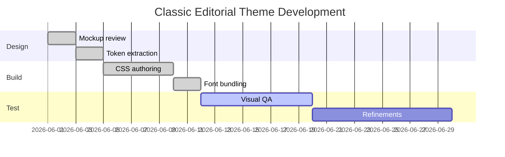
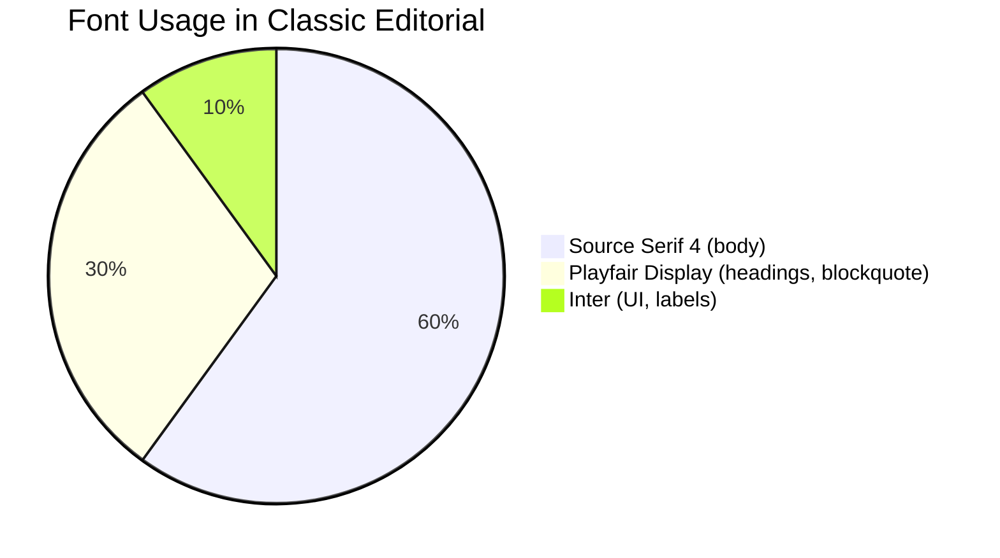

###### THE DIGITAL COMMONS • ISSUE XII

# Reclaiming the Tools We Were Handed

*On why the relationship between people and technology needs to be renegotiated*

###### BY CHRISTOPHER STEEL • JUNE 24, 2026

---

For a generation now, technology has been designed to capture attention rather than serve it. The tools we use daily were not built to extend our capabilities but to harvest them, optimising for engagement metrics that have nothing to do with the lives of the people on the other side of the screen.

> The most powerful technology is the kind that disappears into the work, leaving the person more capable than they were before they picked it up.

## What Agency Actually Looks Like

Reclaiming agency does not mean rejecting technology. It means insisting that the tools we use answer to us rather than to the interests of the platforms that provide them. It means choosing software that can be understood, modified, and owned, and resisting the gradual replacement of skill with dependency.

---

## Theme Test: Headings

# Heading 1

## Heading 2

### Heading 3

#### Heading 4

##### Heading 5

###### Heading 6

---

## Theme Test: Body Text

This is a standard paragraph using Source Serif 4 at 18px. The line-height is 1.7, and paragraphs have a bottom margin of 24px. The body colour is #222 on a white card, which sits on the #f3f3f3 page background. The contrast is clean and the measure feels comfortable at 820px.

**Bold text** sits inside a paragraph. *Italic text* also sits inside a paragraph. **Bold and *bold italic* together** work within the same run. `Inline code` appears within prose. A [link to a source](https://universalcake.ca) uses the inline link style.

---

## Theme Test: Lists

Unordered list:

- First item in the list
- Second item in the list
- Third item, which is a bit longer to test line-height and wrapping behaviour across multiple lines of text in the list

Ordered list:

1. First ordered item
2. Second ordered item
3. Third ordered item, again a bit longer to see how the numeral hangs relative to the wrapped text below it

Nested list:

- Parent item
    - Nested child item
    - Another nested child item
- Back to parent level

Task list:

- [x] Completed task
- [ ] Incomplete task
- [ ] Another incomplete task

---

## Theme Test: Blockquotes

Single-level blockquote:

> Typography is what language looks like. In the digital age, it's become the voice of our visual culture.

Longer blockquote with multiple sentences:

> Good typography is invisible. It does its work quietly, shaping the reader's experience without calling attention to itself. When it fails, however, every reader notices, even if they cannot name what has gone wrong.

---

## Theme Test: Code

Inline code: `font-family: "Playfair Display", serif`

Fenced code block:

```css
h1 {
    font-family: "Playfair Display", serif;
    font-weight: 600;
    font-size: 48px;
    line-height: 1.2;
    margin: 0 0 12px 0;
}
```

```javascript
function applyTheme(selector, tokens) {
    const el = document.querySelector(selector);
    Object.entries(tokens).forEach(([key, value]) => {
        el.style.setProperty(`--${key}`, value);
    });
}
```

```python
def load_theme(path: str) -> dict:
    with open(path, "r") as f:
        return json.load(f)
```

```bash
cp classic-editorial.css ~/.config/Typora/themes/
cp -R classic-editorial ~/.config/Typora/themes/
```

---

## Theme Test: Tables

| Element | Font | Size | Weight |
|---------|------|------|--------|
| Body | Source Serif 4 | 18px | 400 |
| H1 | Playfair Display | 48px | 600 |
| H2 | Playfair Display | 28px | 400 |
| Blockquote | Playfair Display | 24px | 400 italic |
| Meta / H5 | Inter | 12px | 400 |
| Byline / H6 | Inter | 13px | 400 |

---

## Theme Test: Definition List

Source Serif 4
: A contemporary serif typeface by Frank Griesshammer, designed for editorial use at screen and print sizes. Licensed under SIL OFL 1.1.

Playfair Display
: A transitional serif typeface by Claus Eggers Sørensen, suited to titling and display use. Licensed under SIL OFL 1.1.

Inter
: A sans-serif typeface by Rasmus Andersson, optimised for screen legibility at small sizes. Licensed under SIL OFL 1.1.

---

## Theme Test: Horizontal Rule

Before the rule.

---

After the rule.

---

## Theme Test: Footnotes

Typography has been called the invisible art.[^1] When it works well, readers do not notice it. When it fails, they notice immediately, even if they cannot articulate why.[^2]

[^1]: A phrase attributed to various typographers across the twentieth century.
[^2]: Discussed at length in Robert Bringhurst, *The Elements of Typographic Style*, Hartley and Marks, 1992.

---

## Theme Test: Emphasis Variants

Plain text for reference. **Bold text.** *Italic text.* ***Bold italic text.*** ~~Strikethrough text.~~ `Inline code.`

---

## Theme Test: Mermaid Diagrams

Flowchart:



Sequence diagram:



Gantt chart:



Pie chart:



---

## Theme Test: Images


*Caption text sits below the image in italic body type.*

---

## Theme Test: Math

Inline math: $E = mc^2$

Block math:

$$
\int_{-\infty}^{\infty} e^{-x^2} dx = \sqrt{\pi}
$$
